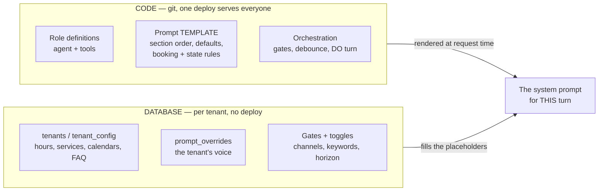
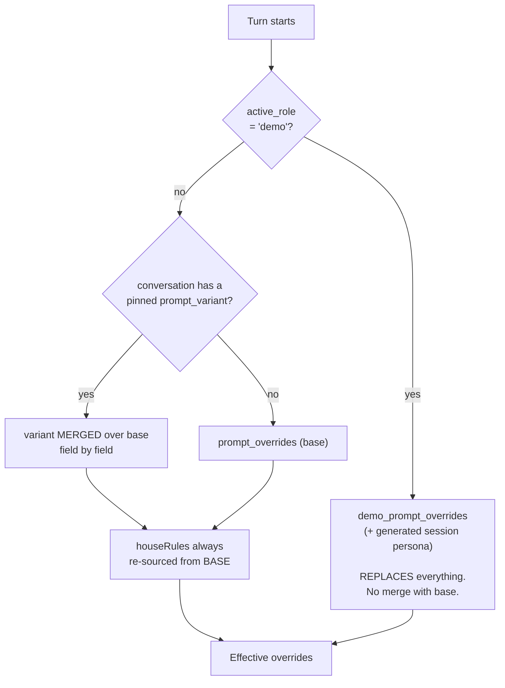
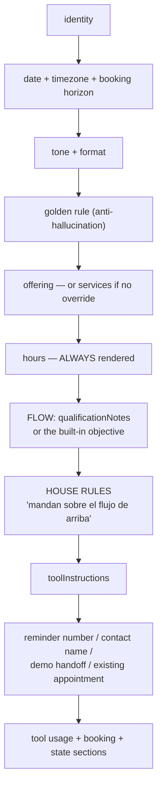
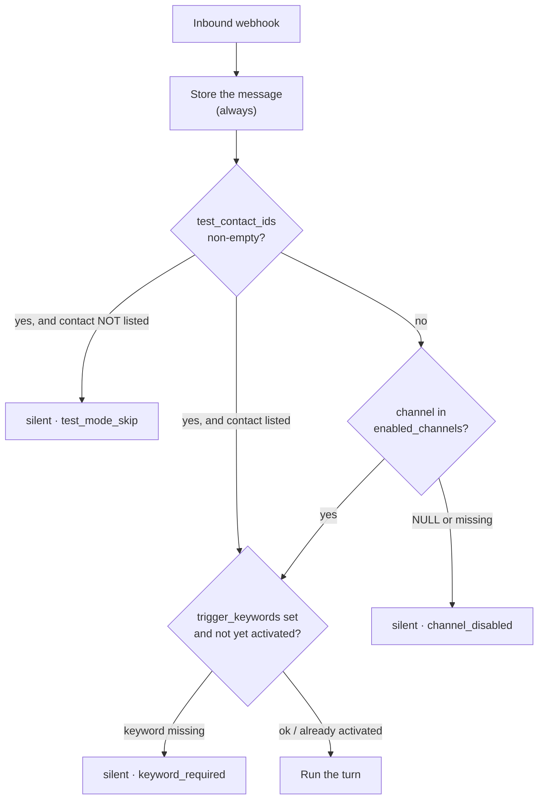
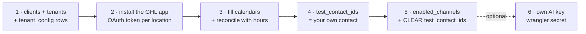

# Config model — tenants, prompts, and what wins over what

> How a single deployed Worker turns into a different agent for every client, and which
> layer beats which when they disagree. Read this before adding a config field, a campaign,
> or a persona.
>
> Same maintenance rule as the rest of `docs/`: if a change alters the picture below, update
> it in the same change. Where this file and the code disagree, the code is right and this
> file is the bug.

---

## 1. The two halves

**The rule that decides where something goes:** if changing it for one client should not
touch the others, it is DB. If it is how the product *works*, it is code. Editing a prompt
in the DB is live for that tenant the instant you write it — no deploy, and **no gradual
rollout**: it hits 100% of that tenant's leads immediately.

---

## 2. Which override set wins (per turn)

Every turn resolves exactly one override set, in `resolveEffectiveOverrides`
(`roles/front-desk/config.ts`).

Three things people get wrong here:

- **The demo persona does not merge.** It replaces the whole set. A rule you keep in base
  simply does not exist inside a demo — deliberately, because the demo is a roleplay of
  someone else's business.
- **The variant merge is a spread, so it replaces a whole FIELD**, not text within it. A
  variant that sets `qualificationNotes` wipes the base's entire flow text — including
  anything else written inside it. Nothing fails; the rule just stops happening.
- **`houseRules` is the one field a variant cannot touch.** That is its whole purpose.

---

## 3. What each layer may override

| Field | Base | Campaign variant | Demo persona |
| --- | --- | --- | --- |
| `identity` | ✅ | ✅ replaces | ✅ (own set) |
| `offering` | ✅ | ✅ replaces | ✅ (own set) |
| `qualificationNotes` (the FLOW) | ✅ | ✅ replaces | ✅ (own set) |
| **`houseRules`** (the RULES) | ✅ | ❌ **never** | 🚫 suppressed |
| `toolInstructions` | ✅ | ✅ merged **per key** | ✅ (own set) |
| `bookingEnabled` | ✅ | ✅ | ✅ |
| `confirmContactName` | ✅ | ❌ base only (handler backstop) | n/a |
| `followUpAngles` | tenant column | ✅ replaces pool | n/a (follow-ups off in demo) |

**Rule of thumb:** the *flow* belongs to the campaign; the *rules* belong to the tenant.
Anything that must survive a campaign goes in `houseRules`.

---

## 4. Prompt assembly order

`buildFrontDeskInstructions` (`roles/front-desk/prompt.ts`). Later sections carry more
weight with the model, which is why the governing rules render **after** the flow.

Two sections are **not** overridable and always render: `# Horario` (from the `hours`
column) and the booking/state blocks (from code, gated by `bookingEnabled`).

---

## 5. Gates — who even gets an answer

Config decides *whether the bot replies at all*, before any prompt is built. Inbound is
**always stored**; only the reply is gated (`worker/webhook-handler.ts`).

- `test_contact_ids` **outranks the channel gate** — a non-empty list means only those
  contacts get replies, on any channel. Forgetting to clear it silently drops every real
  lead (`test_mode_skip` in `bot_events` is the fingerprint).
- `enabled_channels = NULL` means **none**. New tenants are born silent on purpose.
- `trigger_keywords` is an **entry** gate, not per-message: once `bot_activated` is set the
  thread flows without the keyword.
- `keyword_variants` is a different list with a different job — it picks the *prompt*, not
  the *entry*. A keyword can appear in both.

Every blocked turn logs why, so "the bot is slow" is always answerable from `bot_events`.

---

## 6. Where a conversation's state lives

Prompt selection depends on per-conversation state, not just tenant config:

| Column (`conversations`) | Set by | Effect |
| --- | --- | --- |
| `active_role` | demo keywords, `startDemo`, demo end | `demo` → demo persona; `closer` → post-demo setter; NULL → normal |
| `prompt_variant` | first matching campaign keyword | pins the campaign flavor, **first touch sticky** |
| `role_started_at` | every persona transition | history loads from here — the clean-start rule |
| `bot_activated` | trigger-keyword match | the entry gate stays open afterwards |
| `status` | the agent's `updateConversationStatus`, follow-up runner | only `handed_off` mutes the bot; the rest govern follow-up eligibility (business-logic §2a) |

---

## 7. Onboarding a tenant, as a picture

Step 1 must precede step 2 — the OAuth callback resolves the tenant by `locationId` and
404s `unknown_location` otherwise. Everything except step 6 is DB-only: no redeploy.
Procedure and SQL: [`onboarding.md`](onboarding.md).
